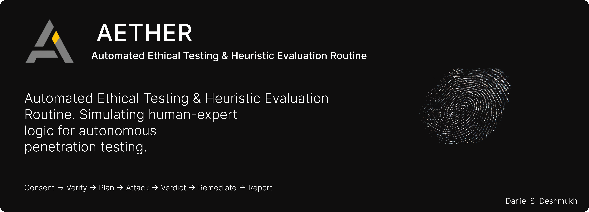

<div align="center">



---

[](https://github.com/DanielDeshmukh/aether)
[](https://github.com/DanielDeshmukh/aether/stargazers)
[](https://build.nvidia.com)
[](https://aether-pentesting.netlify.app)
[](#license)
[](https://nextjs.org)
[](https://typescriptlang.org)
[](https://python.org)

---

AETHER doesn't just scan. It **thinks**, **plans**, **executes**, and **validates** exploits against live targets using AI-powered reasoning, then generates production-ready remediation patches.

</div>

---

## What It Does

AETHER is a **Security-as-a-Service** platform that autonomously discovers, validates, and remediates web application vulnerabilities. It replaces static rule-based scanners with an agentic reasoning loop that mimics how a senior penetration tester approaches a target.

```
Target URL  -->  Recon  -->  AI Planning  -->  Exploit Execution  -->  Validation  -->  Remediation
                  |              |                    |                    |                |
            Tech stack    Nemotron 3 Super     OWASP Top 10         Confirms        Generates
            fingerprint   generates attack    attack lanes with     breach with     copy-paste
            + passive     plan with THOUGHT   Playwright-backed     evidence        security
            recon         / OBSERVE / PLAN    active testing        + screenshots   patches
```

---

## Tech Stack

| Layer | Technology |
|-------|-----------|
| **Frontend** | Next.js 15, React 19, TypeScript, Tailwind CSS |
| **Backend** | Python 3.12, Playwright, NVIDIA NIM (OpenAI-compatible API) |
| **Database** | PostgreSQL 17, Prisma ORM |
| **Auth** | Custom JWT with magic link authentication |
| **AI Orchestration** | Nemotron 3 Super, Llama 3.3 Nemotron, DeepSeek V4 Flash |
| **Browser Automation** | Playwright with headless Chromium |

---

## Project Structure

```
aether/
├── src/app/            # Next.js App Router (pages + API routes)
├── src/lib/            # Auth, DB, email, API utilities
├── prisma/             # Database schema (10 tables)
├── public/             # Static assets
└── backend/            # Python scanning engine (subprocess)
    └── app/
        ├── orchestrator/   # Brain, attack orchestrator
        ├── engine/         # Heuristic, Playwright, validation lanes
        ├── tools/          # Audit, headers, scanner, validators
        └── services/       # Storage, domain verification
```

---

## Core Capabilities

### Autonomous Exploit Execution

AETHER executes **all 10 OWASP Top 10** categories autonomously once consent is verified:

| Category | What AETHER Tests |
|----------|-------------------|
| **A01: Broken Access Control** | Privilege escalation, IDOR, CORS misconfig |
| **A02: Cryptographic Failures** | Weak TLS, mixed content, certificate validation |
| **A03: Injection** | SQL injection, XSS, command injection |
| **A04: Insecure Design** | Business logic flaws, missing rate limiting |
| **A05: Security Misconfiguration** | Default creds, verbose errors, debug endpoints |
| **A06: Vulnerable Components** | Outdated libraries, known CVEs |
| **A07: Auth Failures** | Session management, brute force, token weaknesses |
| **A08: Data Integrity** | Insecure deserialization, supply chain |
| **A09: Logging Failures** | Insufficient logging, missing audit trails |
| **A10: SSRF** | Server-side request forgery, internal network probing |

### AI-Powered Reasoning

AETHER uses a **multi-model NVIDIA NIM pipeline** for different stages of the assessment:

| Model | Role | Why |
|-------|------|-----|
| **Nemotron 3 Super 120B** | Scan planning + final verdicts | 1M context window, reasoning with transparent thought chains |
| **Llama 3.3 Nemotron Super 49B** | Remediation code generation | 91.3% MBPP score, optimized for security patch generation |
| **Nemotron 3 Nano 30B** | Content safety filtering | Sub-second response for real-time safety gating |
| **DeepSeek V4 Flash** | Fast fallback analysis | 284B MoE, ~120 tok/s for high-throughput scenarios |

---

## Safety Architecture

| Control | Implementation |
|---------|---------------|
| **Mandatory Consent** | Scans require explicit ownership verification before execution |
| **SSRF Protection** | Private IPs, loopback, and internal networks are blocked |
| **Rate Limiting** | Per-IP rate limits on scan creation and API endpoints |
| **Quota Enforcement** | Per-user scan quotas with tier-based limits |
| **Token Rotation** | Refresh tokens rotated on every use; all tokens include revocable JTIs |

---

## Getting Started

### Prerequisites
- Node.js 18+
- Python 3.12+
- PostgreSQL 17+

### Setup

```bash
# Clone
git clone https://github.com/DanielDeshmukh/aether.git
cd aether

# Install dependencies
cd aether && npm install
cd ../aether/backend && pip install -r requirements.txt

# Set up environment
cp .env.example .env
# Edit .env with your values

# Run database migrations
npx prisma db push

# Start development
npm run dev
```

---

## License

This project is proprietary software. All rights reserved by the author.

---

<div align="center">

**Built with precision. Deployed with confidence.**

[AETHER Live Demo](https://aether-pentesting.netlify.app) · [Report Issues](https://github.com/DanielDeshmukh/aether/issues)

</div>
